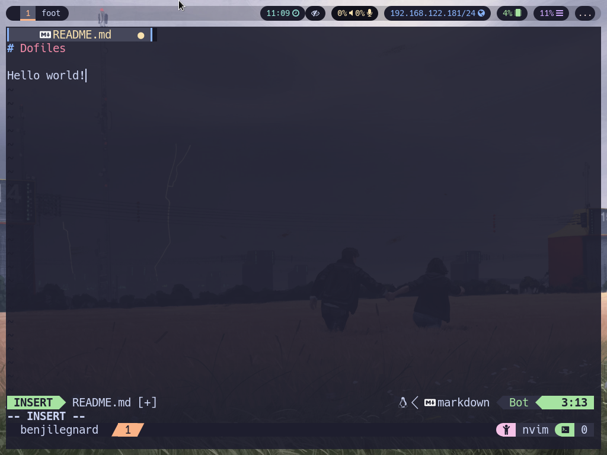
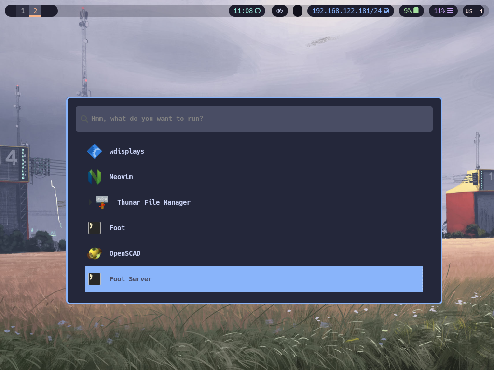

<div align="center">


# Benji Le Gnard's<br/> d&nbsp;&nbsp;o&nbsp;&nbsp;t&nbsp;&nbsp;&nbsp;&nbsp;f&nbsp;&nbsp;i&nbsp;&nbsp;l&nbsp;&nbsp;e&nbsp;&nbsp;s

</div>

This repository holds my dotfiles configuration and ansible playbook config to instantiate a new linux dev machine very quickly.

Also, the main goal is to version my config files and centralize my favorite tools. Expect frequent changes.

> [!WARNING]
> I DECLINE ALL RESPONSIBILITY IF YOU USE THIS ON YOUR SYSTEM AND FUCK UP YOUR COMPUTER

## What's inside

A desktop environment with:
- [swaywm](https://swaywm.org/), a tiling window manager
- [swaylock](https://github.com/swaywm/swaylock#swaylock), a lock screen for sway
- [swaync](https://github.com/ErikReider/SwayNotificationCenter#readme) for notifications
- [waybar](https://github.com/Alexays/Waybar#waybar--) for a "taskbar"
- [rofi](https://github.com/in0ni/rofi-wayland) for launching apps

Wallpapers from [Simon Stalhenag](http://www.simonstalenhag.se/)

Common apps: firefox, gimp, inkscape, audacity, shotcut, openscad, blender, shotwell, mvp, rhytmbox and more

Everything is themed to the [catppuccin color palette](https://catppuccin.com/)

## Screenshots

__Sway, waybar, kitty terminal with tmux and neovim__:



__Rofi__:



## Quick setup

1. Install a debian-based linux distribution, prefer a server version, without a desktop environment
2. Install ansible, git, gpg and sudo :
```
su -
apt-get update && apt-get install -y ansible git sudo gpg
adduser <your_username> sudo
```
3. Run tasks from this repository with ansible
```
ansible-pull --ask-become-pass -U https://github.com/benjilegnard/dotfiles.git -e "user=<your_username> uid=1000"
```
